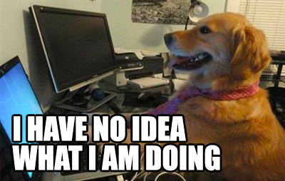

I have just started in the field, and I have realized very quickly that I have no idea what I am doing, and I imagine that I will feel this way for the rest of my life.  I am specifically interested in what a programming language is and what it can do.  I realize that there will be no end, and at no point, I will have a clue of what is going on.  Therefore, I have accepted a simple truth that I will never actually understand what I am doing at any given point of time.

This blog is a documentation of my growth for my own purposes.  A year from now, I imagine I will be laughing hard at my own ignorance.  And again the year after that, and it goes on.

Anyway, enough rambling.

- Kevin
